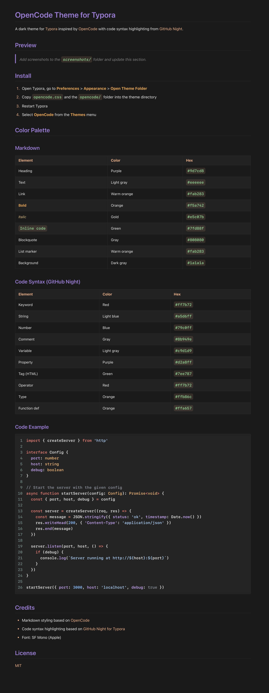

# OpenCode Theme for Typora

A dark theme for [Typora](https://typora.io) inspired by [OpenCode](https://github.com/anomalyco/opencode) with code syntax highlighting from [GitHub Night](https://github.com/kinoute/typora-github-night-theme).

## Preview



## Install

1. Open Typora, go to **Preferences** > **Appearance** > **Open Theme Folder**
2. Copy `opencode.css` and the `opencode/` folder into the theme directory
3. Restart Typora
4. Select **OpenCode** from the **Themes** menu

## Color Palette

### Markdown

| Element | Color | Hex |
|---------|-------|-----|
| Heading | Purple | `#9d7cd8` |
| Text | Light gray | `#eeeeee` |
| Link | Warm orange | `#fab283` |
| **Bold** | Orange | `#f5a742` |
| *Italic* | Gold | `#e5c07b` |
| `Inline code` | Green | `#7fd88f` |
| Blockquote | Gray | `#808080` |
| List marker | Warm orange | `#fab283` |
| Background | Dark gray | `#1a1a1a` |

### Code Syntax (GitHub Night)

| Element | Color | Hex |
|---------|-------|-----|
| Keyword | Red | `#ff7b72` |
| String | Light blue | `#a5d6ff` |
| Number | Blue | `#79c0ff` |
| Comment | Gray | `#8b949e` |
| Variable | Light gray | `#c9d1d9` |
| Property | Purple | `#d2a8ff` |
| Tag (HTML) | Green | `#7ee787` |
| Operator | Red | `#ff7b72` |
| Type | Orange | `#ffb86c` |
| Function def | Orange | `#ffa657` |

### Code Example

```typescript
import { createServer } from 'http'

interface Config {
  port: number
  host: string
  debug: boolean
}

// Start the server with the given config
async function startServer(config: Config): Promise<void> {
  const { port, host, debug } = config

  const server = createServer((req, res) => {
    const message = JSON.stringify({ status: 'ok', timestamp: Date.now() })
    res.writeHead(200, { 'Content-Type': 'application/json' })
    res.end(message)
  })

  server.listen(port, host, () => {
    if (debug) {
      console.log(`Server running at http://${host}:${port}`)
    }
  })
}

startServer({ port: 3000, host: 'localhost', debug: true })
```

## Credits

- Markdown styling based on [OpenCode](https://github.com/anomalyco/opencode)
- Code syntax highlighting based on [GitHub Night for Typora](https://github.com/kinoute/typora-github-night-theme)
- Font: SF Mono (Apple)

## License

[MIT](LICENSE)
